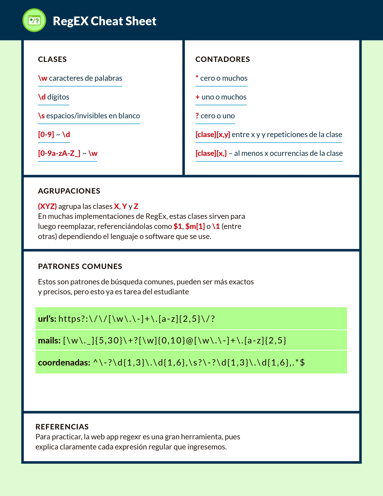
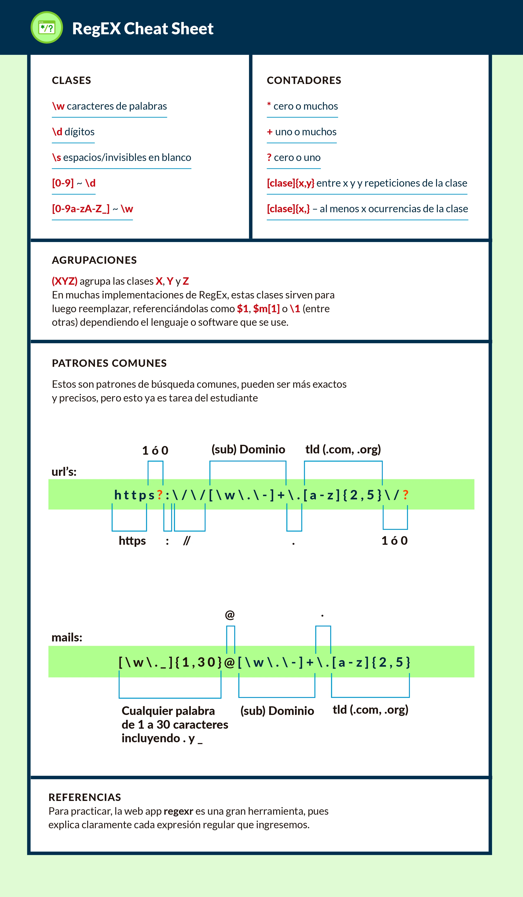

## Presentación
Las Expresiones Regulares son una herramienta de búsqueda y manipulación de cadenas de caracteres increíblemente potente presente en **todos** los lenguajes de programación. Este curso busca llevar al alumno a entenderlas y darles un uso correcto dentro de sus diferentes aplicaciones.

# Expresiones regulares
* `.` encuentra cualquier caracter
* ^ Indica el principio de una cadena
* $ Indica el final de una cadena
* () Un agrupamiento de parte de una expresión
* [] Un conjunto de caracteres de la expresión
* {} Indica un número o intervalo de longitud de la expresión
* . Cualquier caracter salvo el salto de línea
* ? 0-1 ocurrencias de la expresión
* + 1-n ocurrencias de la expresión
* \* 0-n ocurrencias de la expresión
* \ Para escribir un caracter especial como los anteriores y que sea tratado como un literal
* | Para indicar una disyunción lógica (para elegir entre dos valores: a|b se tiene que cumplir al menos uno de los dos)

* Not (^), su uso y sus peligros
* \D -> Encuentra todo lo que no sea un dígito
* \S -> Encuentra todo lo que no sea un espacio
* \W -> Encuentra todo lo que no sea una palabra
* ^ -> Sirve para negar SOLAMENTE dentro los corchetes. Por ejemplo: [^0-5a-c] significa que tomará del 6 al 9 y de la 'd' a la 'z'
## Otros caracteres
* \t — Representa un tabulador.
* \r — Representa el “retorno de carro” o “regreso al inicio” o sea el lugar en que la línea vuelve a iniciar.
* \n — Representa la “nueva línea” el carácter por medio del cual una línea da inicio. Es necesario recordar que en Windows es necesaria una combinación de \r\n para comenzar una nueva línea, mientras que en Unix solamente se usa \n y en Mac_OS clásico se usa solamente \r.
* \a — Representa una “campana” o “beep” que se produce al imprimir este carácter.
* \e — Representa la tecla “Esc” o “Escape”
* \f — Representa un salto de página
* \v — Representa un tabulador vertical
* \x — Se utiliza para representar caracteres ASCII o ANSI si conoce su código. De esta forma, si se busca el símbolo de derechos de autor y la fuente en la que se busca utiliza el conjunto de caracteres Latin-1 es posible encontrarlo utilizando “\xA9”.
* \u — Se utiliza para representar caracteres Unicode si se conoce su código. “\u00A2” representa el símbolo de centavos. No todos los motores de Expresiones Regulares soportan Unicode. El .Net Framework lo hace, pero el EditPad Pro no, por ejemplo.
* \d — Representa un dígito del 0 al 9.
* \w — Representa cualquier carácter alfanumérico.
* \s — Representa un espacio en blanco.
* \D — Representa cualquier carácter que no sea un dígito del 0 al 9.
* \W — Representa cualquier carácter no alfanumérico.
* \S — Representa cualquier carácter que no sea un espacio en blanco.
* \A — Representa el inicio de la cadena. No un carácter sino una posición.
* \Z — Representa el final de la cadena. No un carácter sino una posición.
* \b — Marca la posición de una palabra limitada por espacios en blanco, puntuación o el inicio/final de una cadena.
* \B — Marca la posición entre dos caracteres alfanuméricos o dos no-alfanuméricos.

### Trabajando con lineas:

Para poder buscar en toda una linea por ejemplo podemos usar esto:
`^$` El primer caracter (^) indica el inicio de linea y el simbolo $ el final de linea, todo lo que haya entre esos dos caracteres es la linea entera a buscar

## Graficos

#"Ayudas
Remover directorio .idea/ Utilizar este comando git rm --cached -r .idea

### Reference Documentation

For further reference, please consider the following sections:

* [Official Apache Maven documentation](https://maven.apache.org/guides/index.html)
* [Spring Boot Maven Plugin Reference Guide](https://docs.spring.io/spring-boot/docs/3.2.5/maven-plugin/reference/html/)
* [Create an OCI image](https://docs.spring.io/spring-boot/docs/3.2.5/maven-plugin/reference/html/#build-image)
* [Spring Boot DevTools](https://docs.spring.io/spring-boot/docs/3.2.5/reference/htmlsingle/index.html#using.devtools)
* [Spring Web](https://docs.spring.io/spring-boot/docs/3.2.5/reference/htmlsingle/index.html#web)

### Guides

The following guides illustrate how to use some features concretely:

* [Building a RESTful Web Service](https://spring.io/guides/gs/rest-service/)
* [Serving Web Content with Spring MVC](https://spring.io/guides/gs/serving-web-content/)
* [Building REST services with Spring](https://spring.io/guides/tutorials/rest/)

